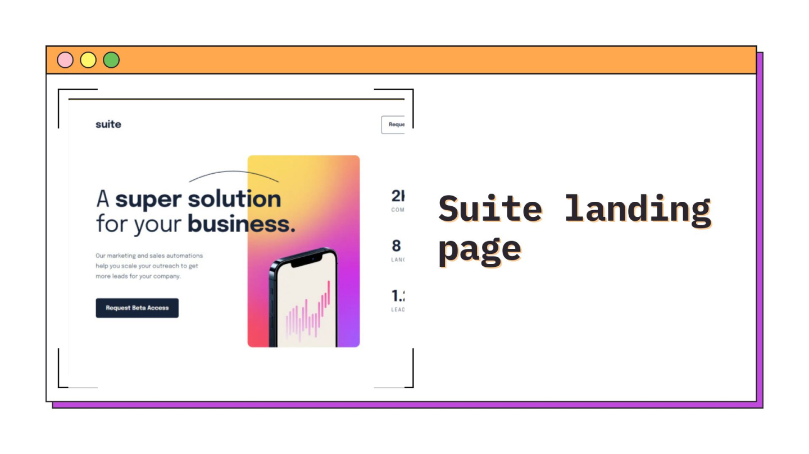
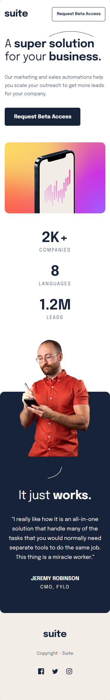
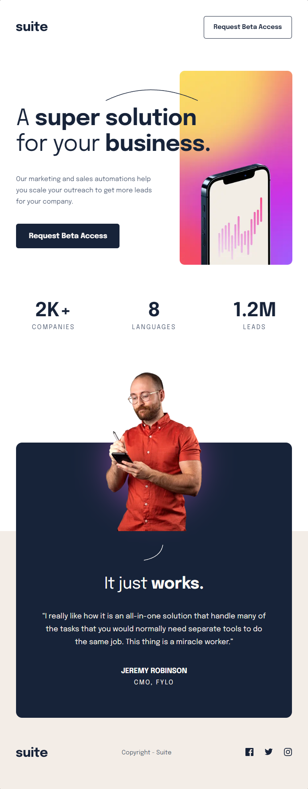
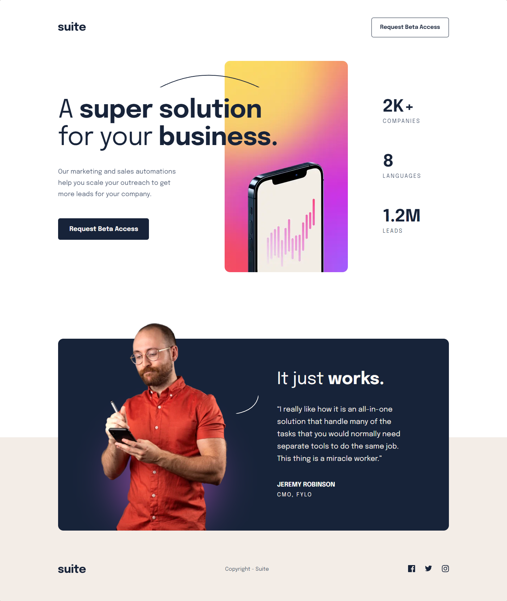

<h1 align="center">Suite landing page
</h1>



<h2 align="center"> 
	🚧 Suite landing page 🟢 Completed 🚀 🚧
  
</h2>

&nbsp;

<!--
## Table of contents

- [Project description](#description) - [What I learned](#What-I-learned) -->

<h2 id="#description">Project description 📚</h2>

This is a solution to the challenge
[Suite landing page](https://www.frontendmentor.io/challenges/suite-landing-page-tj_eaU-Ra).

This is the junior level project of the Mentor frontend site, where I could practice HTML, CSS and responsive.

<a href="https://www.frontendmentor.io/challenges?difficulties=4"></a>

&nbsp;

## What I learned

I used reusable class in this project, to try to make my CSS cleaner, It's a practice that I've been acquiring, before learning SASS.

```css
/* class reusable */
.grid {
  display: grid;
}
.flex {
  display: flex;
}
```

## Links

- [Preview Site](https://suite-vinicius.netlify.app)

&nbsp;

## My process

### Built with

- [HTML](https://developer.mozilla.org/en-US/docs/Web/HTML)
- [CSS](https://developer.mozilla.org/en-US/docs/Web/CSS)
- [Flexbox](https://css-tricks.com/snippets/css/a-guide-to-flexbox/)
- [CSS Grid](https://css-tricks.com/snippets/css/complete-guide-grid/)
- [Metodologia BEM](https://getbem.com/introduction/)

&nbsp;

## Responsive 📱 - Mobile/Tablet/Desktop

<!-- ### Mobile - 375px -->

<!-- ### Tablet - 768px -->

<span>
  
</span>
<span>
   
</span>
<span>
  
</span>
<!-- ### Desktop - 1440px -->

## 👨‍💻 Author

- [Frontend Mentor](https://www.frontendmentor.io/profile/viniciusshenri96)
- [Linkedin](https://www.linkedin.com/in/vinícius-henrique-7a2533229/)
